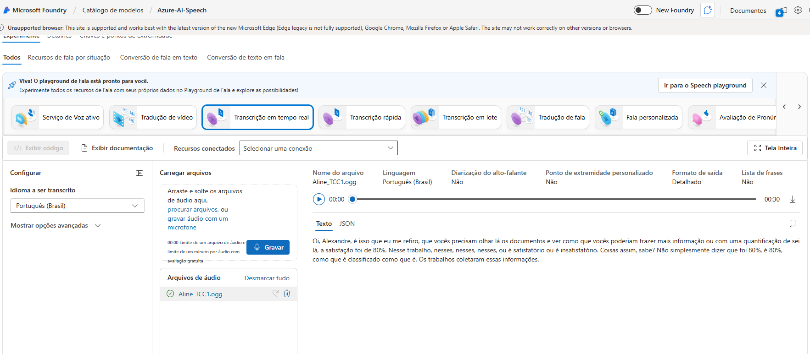
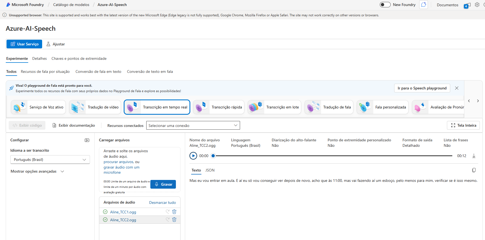
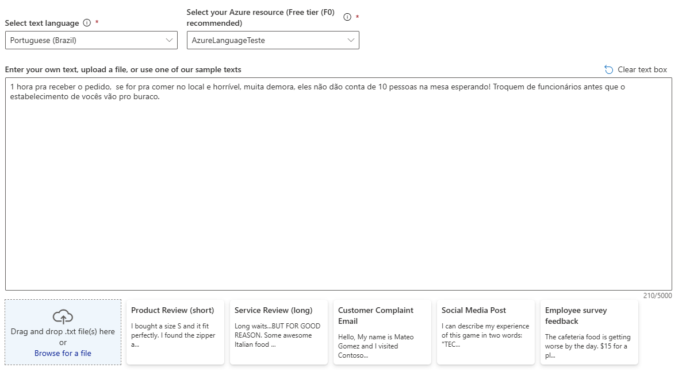
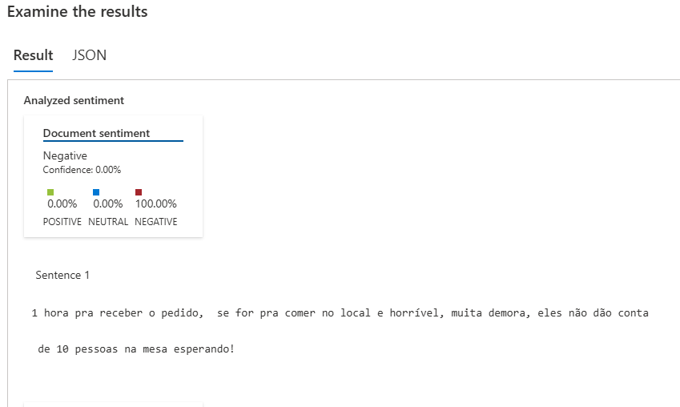
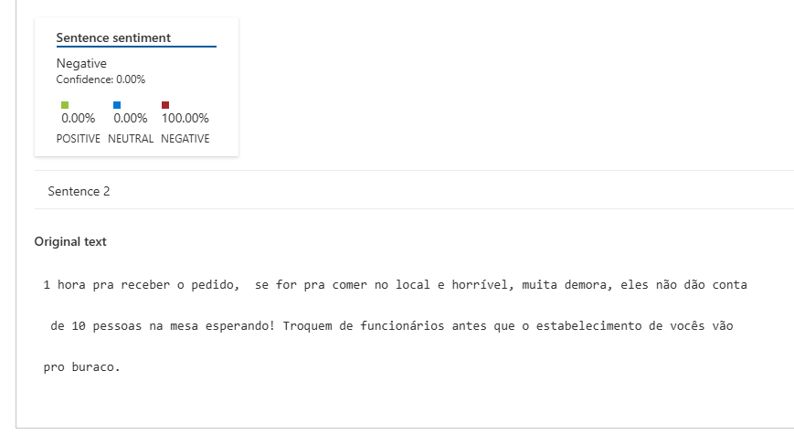
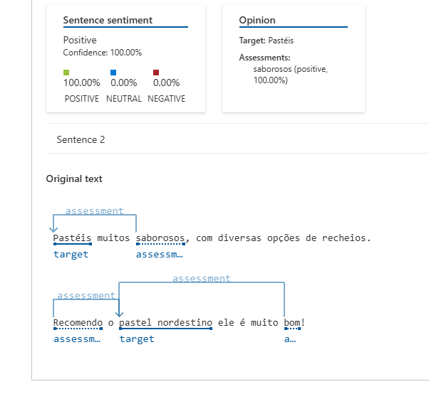
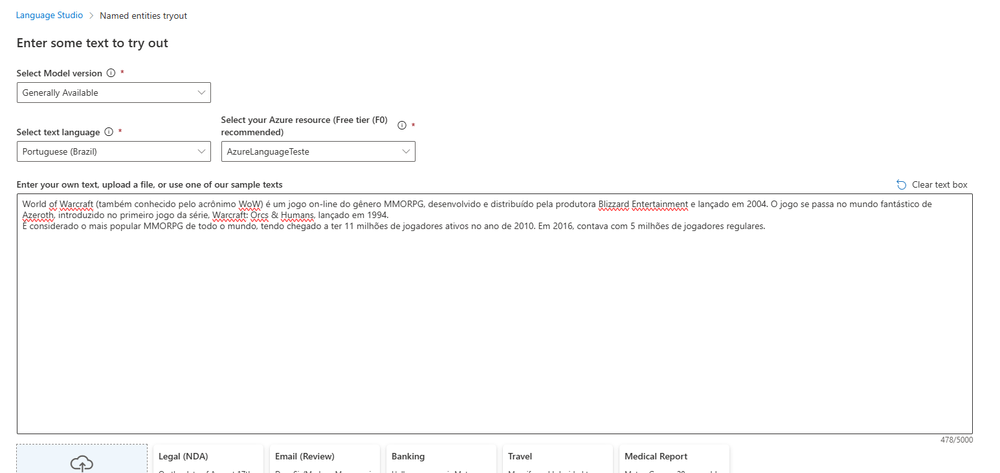
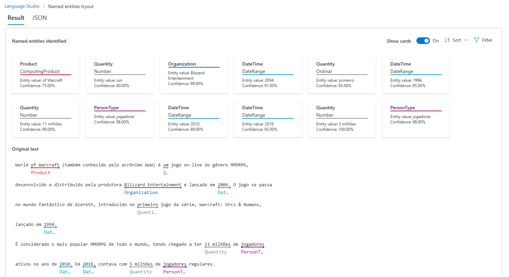

# 📘 Laboratório Azure Speech Studio e Language Studio – Desafio DIO

Este repositório contém a documentação do laboratório prático realizado durante o Bootcamp da DIO, utilizando o **Azure Speech Studio** e o **Azure Language Studio**.  
O objetivo foi explorar ferramentas de IA focadas em **fala** e **linguagem natural**, entendendo seus recursos, aplicando testes e registrando insights adquiridos ao longo da prática.

---

# 🎯 Objetivos do Desafio

- Aplicar, na prática, o uso do **Speech Studio** e **Language Studio** do Azure.  
- Analisar funcionalidades de conversão de fala, transcrição, análise de texto e sentimentos.  
- Documentar de forma clara as atividades realizadas.  
- Utilizar o GitHub para organizar e compartilhar documentação técnica.  
- Consolidar conhecimentos de IA, NLP e entendimento de fala estudados durante o curso.

---

# 🧠 Resumo dos Conceitos Abordados no Curso

Durante as aulas foram apresentados temas fundamentais para o entendimento de IA:

### **IA Generativa**
- O que são modelos de linguagem grandes (LLMs)  
- Arquitetura Transformer  
- Tokenização, embeddings
- Engenharia de prompts  

### **Fundamentos de IA**
- Machine learning, visão computacional e NLP  
- Inteligência de documentos, mineração de conhecimento  
- Princípios de IA responsável: segurança, privacidade, imparcialidade, transparência  

### **Aprendizado de Máquina**
- Tipos: supervisionado, não supervisionado e por reforço  
- Treinamento, avaliação e aprendizado profundo  

### **Processamento de Linguagem Natural**
- Análise de sentimentos  
- Extração de entidades  
- IA de conversação  
- Tradução  
- Recursos de fala no Azure  

### **Hands-on com Azure (parte prática)**
- Speech Studio  
- Language Studio  
- Análise de texto  
- Análise de fala  
- Perguntas e respostas  
- Classificação de sentimentos  

---

# 🧪 Experimentos Realizados

## 🔊 1. Speech Studio – Experimentos

No Speech Studio explorei recursos relacionados à fala, incluindo:

### ✔ Conversão de Fala em Texto (Speech-to-Text)
- Realizei o upload de dois áudios recebidos em Whatsapp.  
- O sistema transcreveu perfeitamente o áudio completo em texto.

### 📸 Prints (exemplos)

```


```

---

## 📝 2. Language Studio – Experimentos

No Language Studio explorei análise de sentimentos e extração de entidades:

### ✔ Análise de Sentimentos
- Inseri 2 avaliações de uma pastelaria e o sistema identificou **positivo**, **negativo** ou **neutro**, com níveis de confiança.

### ✔ Extração de Entidades
- Inseri um texto da wiki de um jogo chamado World of Warcraft, apesar de ter um pequeno erro na identificação do produto, fez a identificação automática de nomes, locais, empresas, datas, etc.

### 📸 Prints (exemplos)

```







```

---

# 📂 Estrutura do Repositório

```
/
├── images/           # Capturas de tela usadas no README
│   ├── language_sentiment1.png
│   ├── language_entity1.png
│   ├── language_speech1.png
│   └── ...
└── README.md         # Este arquivo de documentação
```

---

# 💡 Insights e Aprendizados

Durante a prática pude observar:

- Como ferramentas de IA do Azure permitem testar recursos avançados **sem escrever código**.
- Diferença entre:  
  - **Speech Studio** → Focado em áudio, fala, transcrição e síntese.  
  - **Language Studio** → Focado em sentimentos, entidades e análise textual.
- A facilidade de integrar esses serviços em aplicações reais, como:  
  - Chatbots  
  - Atendimentos automáticos  
  - Análise de reviews e feedbacks  
  - Sistemas multilíngues  
- Como IA generativa e NLP se conectam com modelos modernos de LLMs.

Esse laboratório ajudou a consolidar os conceitos vistos na teoria e visualizar aplicações práticas no dia a dia de um desenvolvedor.

---

# ✅ Conclusão

Este laboratório foi essencial para fortalecer minha compreensão sobre IA aplicada a fala e linguagem natural. O uso do Speech Studio e do Language Studio permitiu uma visão prática de como essas tecnologias funcionam e como podem ser aplicadas em soluções reais.  
O repositório serve como base de estudo, registro e consulta futura.

